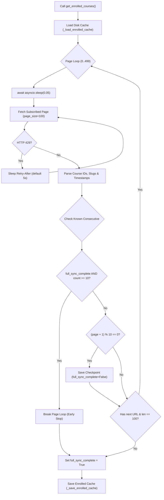

# False Enrollment Remediation & Resilient Library Cache Tracking

**Applies to:** Core enrollment pipeline, CLI, GUI, and background enrollment services  
**Scope:** Course domain model · Dual-key indexing · Atomic disk cache · 500-page sync · Pre-owned timestamp delta detection · Consumer contracts  
**Audience:** Developers, operators, and code reviewers

---

## 1. Executive Summary & Problem Statement

Prior to this remediation, two interrelated issues affected course enrollment accuracy:

1. **False Positive Enrollment Metrics:**  
   When enrolling via [`_du_checkout()`](file:///run/media/madhud/Storage1/LinuxProjects/Codes/Projects/Udemy%20Enroller/app/services/udemy_client.py#L1277) or [`free_checkout()`](file:///run/media/madhud/Storage1/LinuxProjects/Codes/Projects/Udemy%20Enroller/app/services/udemy_client.py#L1345), responses indicating the user was already subscribed (such as HTTP 400 with `"already subscribed"` or a 200 response on verification for an older enrollment) were either treated as successful enrollments or conflated with checkout failures. This falsely inflated the "ENROLLED" count and estimated dollar savings on the dashboard, CLI, and GUI.

2. **Excessive Network Roundtrips on Owned Courses:**  
   Without persistent library tracking and dual-key indexing (slug and numeric ID), consumer pipelines had to query Udemy's coupon validation endpoint for every course encountered—even courses the user had owned for years. In addition, users with large libraries (>5,000 courses) suffered incomplete synchronizations due to tight pagination caps.

### Solutions Delivered
- **Decoupled Ownership State:** Added `is_already_enrolled: bool = False` to [`Course`](file:///run/media/madhud/Storage1/LinuxProjects/Codes/Projects/Udemy%20Enroller/app/services/course.py#L32).
- **Dual-Key Indexing:** Tracked concurrently by slug (`enrolled_courses: Dict[str, str]`) and numeric ID (`enrolled_course_ids: Set[str]`).
- **Atomic Disk Cache Persistence:** Written to `data/cache/enrolled_courses_{udemy_user_id}.json` using a `.tmp` staging file, explicit `os.fsync`, and atomic `os.replace`.
- **500-Page Deep Synchronization:** Up to 50,000 courses with 50ms cooperative delays, 429 `Retry-After` backoff, 10-page disk checkpoints, and early stopping gated strictly on `full_sync_complete is True`.
- **Pre-owned Course Detection:** Sub-15s timestamp delta comparison against checkout start time (`(checkout_start_dt - enroll_dt).total_seconds() > 15`).
- **0ms Fast Pre-check:** Pre-enrollment library bypass in CLI `enroll`, CLI `check`, GUI `AsyncioBridge`, and `EnrollmentManager`.

---

## 2. Core Domain Model Changes

In [`app/services/course.py`](file:///run/media/madhud/Storage1/LinuxProjects/Codes/Projects/Udemy%20Enroller/app/services/course.py):

```python
class Course:
    def __init__(self, title: str, url: str, site: str = None):
        ...
        self.error: str = None
        self.status = None
        self.is_already_enrolled: bool = False
```

- `self.status`: Represents the outcome of the checkout operation (`True` for newly enrolled, `False` for failure/pre-owned, `None` for indeterminate/unverified).
- `self.is_already_enrolled`: An explicit boolean flag indicating the course is already in the user's account, preventing conflation between genuine checkouts and existing library ownership.

---

## 3. Dual-Key Library Indexing & In-Memory State

In [`app/services/udemy_client.py`](file:///run/media/madhud/Storage1/LinuxProjects/Codes/Projects/Udemy%20Enroller/app/services/udemy_client.py):

Udemy API endpoints alternate between course URL slugs (e.g. `python-masterclass`) and numeric course IDs (e.g. `1234567`). Relying on a single key caused cache misses during checkout workflows where only one identifier was known.

[`UdemyClient`](file:///run/media/madhud/Storage1/LinuxProjects/Codes/Projects/Udemy%20Enroller/app/services/udemy_client.py#L29) maintains dual in-memory structures:
- `self.enrolled_courses: Dict[str, str]`: Maps course slug to ISO-8601 enrollment timestamp (e.g. `"2026-01-15T12:00:00Z"`).
- `self.enrolled_course_ids: Set[str]`: Set of stringified numeric course IDs.
- `self.full_sync_complete: bool`: Tracks whether an end-to-end library sync has completed across all pages.

### Fast Membership Resolution

```python
async def is_already_enrolled(
    self, course: Course, known_slugs: Optional[Set[str]] = None
) -> bool:
    if known_slugs and course.slug in known_slugs:
        return True
    if (
        self.enrolled_courses is not None
        and course.slug
        and course.slug in self.enrolled_courses
    ):
        return True
    if course.course_id and str(course.course_id) in self.enrolled_course_ids:
        return True
    return False
```

---

## 4. Resilient Atomic Disk Cache Persistence

Library data is persisted per user on disk at:
`data/cache/enrolled_courses_{udemy_user_id}.json`

### Atomic Write Protocol (`_save_enrolled_cache`)

1. **Anonymous Isolation:** If `self.udemy_user_id` is empty or None, the method returns `False` immediately, keeping session data strictly in memory and preventing cache collisions.
2. **Defensive Directory Creation:** `cache_path.parent.mkdir(parents=True, exist_ok=True)` ensures the target directory exists.
3. **Staging File:** The payload is dumped to `enrolled_courses_{user_id}.json.tmp`.
4. **Flushing & Syncing:** Calls `f.flush()` followed by `os.fsync(f.fileno())` to guarantee data reaches physical storage before directory entries are updated.
5. **Atomic Rename:** `os.replace(tmp_path, cache_path)` replaces the destination atomically, preventing corrupt reads if the process terminates abruptly.

### Fault-Tolerant Cache Loading (`_load_enrolled_cache`)

- Safely parses JSON; if unreadable or corrupted, logs a warning and returns `False` without raising an exception.
- Backwards compatible with legacy single-dictionary caches: automatically upgrades payloads containing `{"enrolled_courses": ..., "enrolled_course_ids": ...}` or bare dictionary mappings.
- Restores `full_sync_complete` state to avoid repeating exhaustive library synchronizations across restarts.

---

## 5. 500-Page Synchronization Lifecycle

[`get_enrolled_courses()`](file:///run/media/madhud/Storage1/LinuxProjects/Codes/Projects/Udemy%20Enroller/app/services/udemy_client.py#L493) queries the subscribed courses mobile endpoint:

`https://www.udemy.com/api-2.0/users/me/subscribed-courses/?ordering=-enroll_time&fields[course]=id,enrollment_time,url&page_size=100`



### Safety & Performance Parameters
- **Capacity:** Paginates up to `max_pages = 500` (up to 50,000 courses).
- **Pacing:** Cooperatively pauses 50ms (`await asyncio.sleep(0.05)`) between pages to avoid triggering network firewalls.
- **429 Resilience:** Reads `Retry-After` header when rate limited; backs off up to 3 retry attempts per page.
- **10-Page Disk Checkpointing:** Saves cache every 10 pages with `full_sync_complete = False`. If interrupted, previous pages are preserved.
- **Strict Early Stop Guard:** Iterates newest-first (`ordering=-enroll_time`). When encountering 10 consecutive courses already present in cache, pagination breaks early **only if** `full_sync_complete is True`. If an initial full sync has not completed, it continues through all pages.

---

## 6. Checkout Normalization & Pre-owned Detection

### `_du_checkout()` Normalization
When `/payment/checkout-submit/` returns HTTP 400 with `"already subscribed"` or `"already_enrolled"`:
- Sets `course.status = False` (not a new enrollment).
- Sets `course.is_already_enrolled = True`.
- Sets `course.error = "already_enrolled"`.
- Indexes the slug and ID in cache and invokes `_save_enrolled_cache()`.

### `free_checkout()` Timestamp Delta Detection
For 100% off free courses using the subscription endpoint:
1. **Pre-Check Bypass:** If `course.is_already_enrolled` or `await is_already_enrolled(course)`, immediately exits with `course.status = False`, `course.is_already_enrolled = True`, `course.error = "already_enrolled"` without performing HTTP GET requests.
2. **Checkout Timestamp Recording:** Records `checkout_start_dt = datetime.now(timezone.utc)`.
3. **API Enrollment Verification:** Calls `/users/me/subscribed-courses/{course_id}/?fields[course]=@default,enrollment_time`.
4. **Timestamp Delta Evaluation:**

```python
enroll_dt = datetime.fromisoformat(enrollment_time.replace("Z", "+00:00"))
if (checkout_start_dt - enroll_dt).total_seconds() > 15:
    is_pre_owned = True
```

   If enrollment occurred more than 15 seconds before the checkout call, it was enrolled in a prior session. It is flagged as pre-owned (`course.status = False`, `course.is_already_enrolled = True`), updating the cache.

### `checkout_single()` Fallback Guard
- Bypasses checkout if `is_already_enrolled` is True on entry.
- When `free_checkout` or `_du_checkout` sets `course.is_already_enrolled = True`, secondary fallback checkout attempts are skipped, preventing duplicate requests and false success states.

---

## 7. Consumer Integration Contracts

The enrollment contract distinguishes 4 states across all consumers:

| Checkout Result (`success`) | `course.is_already_enrolled` | Semantics | CLI / GUI Indicator | Metric Updated |
|---|---|---|---|---|
| `True` | `False` | Successfully Enrolled | `★ ENROLLED` (Green) | `successfully_enrolled_c += 1`, `amount_saved_c += list_price` |
| `False` | `True` | Pre-Owned / In Library | `● [ALREADY OWNED]` (Yellow) | `already_enrolled_c += 1`, $0 savings |
| `None` | `False` | Timeout / Indeterminate | `? [INDETERMINATE / TIMEOUT]` (Yellow) | `unknown_c += 1` |
| `False` | `False` | Checkout Failed | `✗ FAILED` (Red) | `unknown_c += 1` |

### 0ms Fast Pre-check in Pipeline Loops
In [`app/cli/commands/enroll.py`](file:///run/media/madhud/Storage1/LinuxProjects/Codes/Projects/Udemy%20Enroller/app/cli/commands/enroll.py), [`app/cli/commands/check.py`](file:///run/media/madhud/Storage1/LinuxProjects/Codes/Projects/Udemy%20Enroller/app/cli/commands/check.py), [`app/gui/bridge.py`](file:///run/media/madhud/Storage1/LinuxProjects/Codes/Projects/Udemy%20Enroller/app/gui/bridge.py), and [`app/services/enrollment_manager.py`](file:///run/media/madhud/Storage1/LinuxProjects/Codes/Projects/Udemy%20Enroller/app/services/enrollment_manager.py):

```python
# Check if already enrolled in library before calling check_course
for course in courses:
    is_enrolled = udemy_client.is_already_enrolled(course)
    if inspect.isawaitable(is_enrolled):
        is_enrolled = await is_enrolled
    elif not isinstance(is_enrolled, bool):
        is_enrolled = False

    if is_enrolled:
        course.is_already_enrolled = True
        udemy_client.already_enrolled_c += 1
        progress.console.print(f"  [yellow]●[/yellow] [dim]{course.title[:45]:<45} [ALREADY OWNED][/dim]")
        continue
```

This bypasses `check_course()` entirely for pre-owned courses, saving 1–2 network roundtrips per course.

---

## 8. Verification & Test Suite

The changes are validated by unit tests:

1. **[`tests/test_udemy_client_cache.py`](file:///run/media/madhud/Storage1/LinuxProjects/Codes/Projects/Udemy%20Enroller/tests/test_udemy_client_cache.py)** (10 tests):
   - `test_cache_save_and_load_roundtrip`: Verifies atomic disk save and reload of dual-key indices and `full_sync_complete`.
   - `test_cache_noop_when_user_id_empty`: Confirms memory-only isolation when `udemy_user_id` is missing.
   - `test_cache_load_corrupted_json`: Verifies safe handling of corrupted JSON files without crashing.
   - `test_get_enrolled_courses_checkpointing_and_pacing`: Asserts 10-page incremental checkpointing and final sync completion.
   - `test_get_enrolled_courses_early_stop_when_full_sync_complete`: Asserts early stopping after 10 consecutive known items when `full_sync_complete is True`.
   - `test_get_enrolled_courses_no_early_stop_when_full_sync_false`: Ensures early stopping does NOT fire when `full_sync_complete is False`.
   - `test_free_checkout_pre_owned_timestamp_greater_than_15s`: Asserts pre-owned detection when `(checkout_start_dt - enroll_dt) > 15s`.
   - `test_free_checkout_newly_enrolled_timestamp`: Asserts newly enrolled course yields `status is True` and `is_already_enrolled is False`.
   - `test_free_checkout_fast_precheck_skips_http`: Verifies HTTP calls are bypassed for known courses.
   - `test_cli_fast_precheck_bypasses_check_course`: Tests CLI enroll execution bypassing `check_course` for owned courses.

2. **[`tests/test_udemy_checkout_limits.py`](file:///run/media/madhud/Storage1/LinuxProjects/Codes/Projects/Udemy%20Enroller/tests/test_udemy_checkout_limits.py)**:
   - Line 261 (`test_du_checkout_already_subscribed_400`): Asserts `status is False`, `is_already_enrolled is True`, and `error == "already_enrolled"`.
