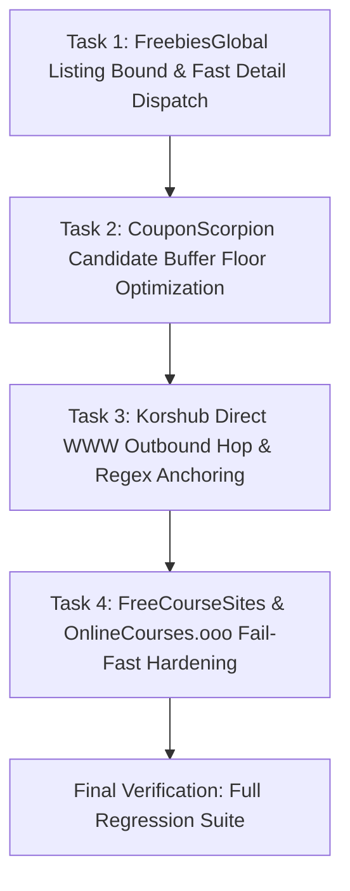

# Implementation Plan v4: Scraper Bottlenecks & Fail-Fast Hardening

## Executive Summary
This revised, hardened Plan v4 eliminates throughput bottlenecks, unbounded crawling, redirect latency, and unnecessary network thrashing across four critical scrapers in [`app/services/scraper.py`](file:///run/media/madhud/Storage/LinuxProjects/Codes/Projects/Udemy%20Enroller/app/services/scraper.py):
1. **FreebiesGlobal (`fg`)**: Fixes unbounded candidate buffering by enforcing dynamic floor/ceiling limits (`min(CANDIDATE_BUFFER, max(MAX_COURSES * 3, 20))`) and prevents slow retries on dead detail pages via `attempts=1, timeout=8` (`CRIT-01`, `REV-PLAN-02`, `FM-04`).
2. **CouponScorpion (`cs`)**: Reduces candidate buffer floor from 250 to 50 (`max(MAX_COURSES * 3, 50)`), aligning candidate harvesting with configured course limits and updating existing diversity floor assertions (`CRIT-02`).
3. **Korshub (`kh`)**: Eliminates redundant 301/308 redirect round-trips by directly routing go-hops to `https://www.korshub.com{path}`, and hardens regex URL extraction to prevent off-host leaks and correctly parse JSON-escaped slashes (`CRIT-03`, `REV-PLAN-04`, `FM-05`, `FM-KH-01`).
4. **FreeCourseSites (`fcs`) & OnlineCourses.ooo (`oc`)**: Implements compound Cloudflare WAF detection (HTTP 403/429/503 + Turnstile/challenge signatures) with immediate circuit breaking and fail-fast termination, preventing cascading HTML fallback or Playwright executions when blocked (`CRIT-04`, `REV-PLAN-01`, `REV-PLAN-03`, `FM-01`, `FM-03`, `FM-CF-01`, `FM-OC-01`).
5. **Rollback & Execution Isolation**: Solves multi-task file mutation collisions in [`app/services/scraper.py`](file:///run/media/madhud/Storage/LinuxProjects/Codes/Projects/Udemy%20Enroller/app/services/scraper.py) via mandatory per-task atomic git commit instructions (`REV-PLAN-05`, `FM-02`).

---

## Traceability & Remediation Matrix

| Finding ID | Source | Scope | Concrete Resolution in Plan v4 |
| :--- | :--- | :--- | :--- |
| **REV-PLAN-01** | Reviewer | FCS & OC | Added unit tests in `tests/test_freecoursesites_scraper.py` and `tests/test_onlinecourses_scraper.py` asserting `scraper.error == "Blocked by Cloudflare Turnstile WAF"` on 403 challenge. |
| **REV-PLAN-02** | Reviewer | FreebiesGlobal | Added unit test in `tests/test_freebiesglobal_scraper.py` asserting candidate limit bounding and `attempts=1, timeout=8` on detail calls. |
| **REV-PLAN-03** | Reviewer | FCS REST Scraper | Added outer category loop break in `_scrape_rest_api` on `_cf_403_observed` to prevent 5 redundant blocked category requests. |
| **REV-PLAN-04** | Reviewer | Korshub Regex | Added unit test in `tests/test_korshub_scraper.py` asserting JSON-LD Udemy regex matching and non-Udemy rejection. |
| **REV-PLAN-05** | Reviewer | Git Rollback | Mandated atomic git commits after each micro-task passes verification, isolating `git checkout HEAD -- <file>` rollbacks. |
| **FM-01** | Critic | Turnstile DoS Risk | Gated Turnstile detection on compound check (status $\in \{403, 429, 503\}$ AND structural CF signatures), preventing false-positives on course content. |
| **FM-02** | Critic | Rollback Collision | Enforced per-task commit checkpoints (`git commit -m "feat(<task>): ..."`) before advancing to subsequent tasks. |
| **FM-03** | Critic | 404 False Break | Gated outer loop break strictly on `_cf_403_observed` and `circuit_open`, not general empty/404 responses. |
| **FM-04** | Critic | Hop Retry Leak | Enforced `attempts=1, timeout=8` across all detail and hop resolution calls in `_fetch_post`. |
| **FM-05** | Critic | Escaped Slashes | Hardened JSON-LD regex to support JSON-escaped slashes throughout path: `r'"url":\s*"(https?:?(?:/|\\/){2}(?:www\.)?udemy\.com(?:/|\\/)course(?:/|\\/)[^"]+)"'`. |
| **FM-KH-01** | Critic | Korshub Slash Escaping | Path slashes in `/course/` permit both `/` and `\/` to avoid regex match failure on JSON-escaped payloads. |
| **FM-CF-01** | Critic | Compound Boolean Logic | Explicitly enforce strict Boolean `AND` between HTTP status $\in \{403, 429, 503\}$ and structural signature presence. |
| **FM-OC-01** | Critic | OC Feed Early Abort | In `OnlineCoursesScraper.scrape()`, add early return immediately following `_fetch_feed_items()` when WAF blocked. |

---

## Task Classification Summary
| Task ID | Component | Task Type | Est. Diff (Src / Test) | Max Diff Budget | Domain Gates |
| :--- | :--- | :--- | :--- | :--- | :--- |
| **Task 1** | FreebiesGlobal Bounding & Detail Dispatch | `code_fix` | +15/-5 (Src), +20/-0 (Test) | $\le 65$ lines | `reviewer`, `critic` |
| **Task 2** | CouponScorpion Buffer Floor Optimization | `code_fix` | +3/-3 (Src), +1/-1 (Test) | $\le 15$ lines | `reviewer`, `critic` |
| **Task 3** | Korshub Direct WWW Hop & Regex Anchoring | `code_fix` | +5/-5 (Src), +20/-0 (Test) | $\le 40$ lines | `reviewer`, `critic` |
| **Task 4** | FCS & OnlineCourses Fail-Fast Hardening | `code_fix` | +22/-6 (Src), +30/-0 (Test) | $\le 65$ lines | `reviewer`, `critic` |

---

## Phased Task DAG



---

## Discrete Task Specifications

### Task 1: FreebiesGlobal Listing Bound & Fast Detail Dispatch (`CRIT-01`, `REV-PLAN-02`, `FM-04`)
- **Task Type**: `code_fix`
- **Target Files**:
  - [`app/services/scraper.py`](file:///run/media/madhud/Storage/LinuxProjects/Codes/Projects/Udemy%20Enroller/app/services/scraper.py)
  - [`tests/test_freebiesglobal_scraper.py`](file:///run/media/madhud/Storage/LinuxProjects/Codes/Projects/Udemy%20Enroller/tests/test_freebiesglobal_scraper.py)
- **Symbol Signatures**:
  - `async def FreebiesGlobalScraper.scrape(self, detail_semaphore: asyncio.Semaphore) -> None`
  - `async def FreebiesGlobalScraper.scrape._fetch_post(post_url: str) -> tuple[Optional[str], Optional[str]]`
- **Dependencies**: None
- **Diff Budget**: $\le 35$ lines in `scraper.py`, $\le 30$ lines in `test_freebiesglobal_scraper.py`
- **Domain Gate**: `reviewer`, `critic`
- **Declarative Acceptance Criteria (DoD)**:
  - [ ] `candidate_limit` in [`FreebiesGlobalScraper.scrape`](file:///run/media/madhud/Storage/LinuxProjects/Codes/Projects/Udemy%20Enroller/app/services/scraper.py#L3978-L4050) is dynamically computed as:
        `candidate_limit = min(getattr(self, "CANDIDATE_BUFFER", 750), max(self.MAX_COURSES * 3, 20))`
  - [ ] Listing loop breaks immediately when `len(candidates) >= candidate_limit` or `len(self.data) + len(candidates) >= candidate_limit`.
  - [ ] In `_fetch_post`, detail calls to `self.http.get` explicitly specify `attempts=1, timeout=8, raise_for_status=False, use_cloudscraper=True`.
  - [ ] Unit test added in [`tests/test_freebiesglobal_scraper.py`](file:///run/media/madhud/Storage/LinuxProjects/Codes/Projects/Udemy%20Enroller/tests/test_freebiesglobal_scraper.py) verifying candidate limit bounding when `MAX_COURSES` is small (e.g. 5 courses bounds candidates to 20), and asserting detail requests pass `attempts=1` and `timeout=8`.
  - [ ] Atomic git commit executed upon test pass: `git commit -m "feat(fg): bound candidate collection and enforce fast detail dispatch"`
- **Verification Command**:
  ```bash
  ./venv/bin/pytest tests/test_freebiesglobal_scraper.py -v
  ```
- **Rollback Script**:
  ```bash
  git checkout HEAD -- app/services/scraper.py tests/test_freebiesglobal_scraper.py
  ```

---

### Task 2: CouponScorpion Candidate Buffer Floor Optimization (`CRIT-02`)
- **Task Type**: `code_fix`
- **Target Files**:
  - [`app/services/scraper.py`](file:///run/media/madhud/Storage/LinuxProjects/Codes/Projects/Udemy%20Enroller/app/services/scraper.py)
  - [`tests/test_couponscorpion_scraper.py`](file:///run/media/madhud/Storage/LinuxProjects/Codes/Projects/Udemy%20Enroller/tests/test_couponscorpion_scraper.py)
- **Symbol Signatures**:
  - `async def CouponScorpionScraper._collect_rest_posts(self) -> list[tuple[str, str]]`
- **Dependencies**: Task 1
- **Diff Budget**: $\le 10$ lines in `scraper.py`, $\le 5$ lines in `test_couponscorpion_scraper.py`
- **Domain Gate**: `reviewer`, `critic`
- **Declarative Acceptance Criteria (DoD)**:
  - [ ] In [`CouponScorpionScraper._collect_rest_posts`](file:///run/media/madhud/Storage/LinuxProjects/Codes/Projects/Udemy%20Enroller/app/services/scraper.py#L3558-L3600), `buffer_limit` computation is updated to:
        `buffer_limit = min(getattr(self, "CANDIDATE_BUFFER", 800), max(self.MAX_COURSES * 3, 50))`
  - [ ] In [`tests/test_couponscorpion_scraper.py:test_candidate_buffer_diversity_floor`](file:///run/media/madhud/Storage/LinuxProjects/Codes/Projects/Udemy%20Enroller/tests/test_couponscorpion_scraper.py#L313-L338), the assertion `assert len(collected) == 250` is updated to `assert len(collected) == 50`.
  - [ ] Existing CouponScorpion test suite passes without regressions.
  - [ ] Atomic git commit executed upon test pass: `git commit -m "feat(cs): optimize candidate buffer floor to 50"`
- **Verification Command**:
  ```bash
  ./venv/bin/pytest tests/test_couponscorpion_scraper.py -v
  ```
- **Rollback Script**:
  ```bash
  git checkout HEAD -- app/services/scraper.py tests/test_couponscorpion_scraper.py
  ```

---

### Task 3: Korshub Direct WWW Outbound Hop & Regex Anchoring (`CRIT-03`, `REV-PLAN-04`, `FM-05`, `FM-KH-01`)
- **Task Type**: `code_fix`
- **Target Files**:
  - [`app/services/scraper.py`](file:///run/media/madhud/Storage/LinuxProjects/Codes/Projects/Udemy%20Enroller/app/services/scraper.py)
  - [`tests/test_korshub_scraper.py`](file:///run/media/madhud/Storage/LinuxProjects/Codes/Projects/Udemy%20Enroller/tests/test_korshub_scraper.py)
- **Symbol Signatures**:
  - `def KorshubScraper._allowed_go_hop(self, href: str, base: str) -> Optional[str]`
  - `def KorshubScraper._extract_udemy_url_from_text(self, text: str) -> Optional[str]`
- **Dependencies**: Task 2
- **Diff Budget**: $\le 15$ lines in `scraper.py`, $\le 25$ lines in `test_korshub_scraper.py`
- **Domain Gate**: `reviewer`, `critic`
- **Declarative Acceptance Criteria (DoD)**:
  - [ ] In [`KorshubScraper._allowed_go_hop`](file:///run/media/madhud/Storage/LinuxProjects/Codes/Projects/Udemy%20Enroller/app/services/scraper.py#L1796-L1806), outbound hop URL directly returns `f"https://www.korshub.com{parsed.path}"`, eliminating apex 301/308 redirect roundtrips.
  - [ ] In [`KorshubScraper._extract_udemy_url_from_text`](file:///run/media/madhud/Storage/LinuxProjects/Codes/Projects/Udemy%20Enroller/app/services/scraper.py#L1827-L1861), JSON-LD/Next.js Flight regex is anchored to Udemy domain with escaped/unescaped slash support across both protocol and `/course/` path:
        `r'"url":\s*"(https?:?(?:/|\\/){2}(?:www\.)?udemy\.com(?:/|\\/)course(?:/|\\/)[^"]+)"'`
        and normalized via `.replace(r"\/", "/")`.
  - [ ] Unit tests added in [`tests/test_korshub_scraper.py`](file:///run/media/madhud/Storage/LinuxProjects/Codes/Projects/Udemy%20Enroller/tests/test_korshub_scraper.py) verifying:
        1. Positive match for standard unescaped URL (`"https://www.udemy.com/course/..."`).
        2. Positive match for JSON-escaped URL (`"https:\/\/www.udemy.com\/course\/..."`).
        3. Negative rejection for non-Udemy hosts (`"https://evil.com/course/..."`).
  - [ ] Existing Korshub tests pass with zero regressions.
  - [ ] Atomic git commit executed upon test pass: `git commit -m "feat(kh): direct www outbound hop and hardened regex extraction"`
- **Verification Command**:
  ```bash
  ./venv/bin/pytest tests/test_korshub_scraper.py -v
  ```
- **Rollback Script**:
  ```bash
  git checkout HEAD -- app/services/scraper.py tests/test_korshub_scraper.py
  ```

---

### Task 4: FreeCourseSites & OnlineCourses.ooo Fail-Fast Hardening (`CRIT-04`, `REV-PLAN-01`, `REV-PLAN-03`, `FM-01`, `FM-03`, `FM-CF-01`, `FM-OC-01`)
- **Task Type**: `code_fix`
- **Target Files**:
  - [`app/services/scraper.py`](file:///run/media/madhud/Storage/LinuxProjects/Codes/Projects/Udemy%20Enroller/app/services/scraper.py)
  - [`tests/test_freecoursesites_scraper.py`](file:///run/media/madhud/Storage/LinuxProjects/Codes/Projects/Udemy%20Enroller/tests/test_freecoursesites_scraper.py)
  - [`tests/test_onlinecourses_scraper.py`](file:///run/media/madhud/Storage/LinuxProjects/Codes/Projects/Udemy%20Enroller/tests/test_onlinecourses_scraper.py)
- **Symbol Signatures**:
  - `async def FreeCourseSitesScraper._scrape_rest_api(self, seen_urls: set[str]) -> None`
  - `async def FreeCourseSitesScraper.scrape(self, detail_semaphore: asyncio.Semaphore) -> None`
  - `async def OnlineCoursesScraper._fetch_feed_items(self) -> list[tuple[str, str]]`
  - `async def OnlineCoursesScraper.scrape(self, detail_semaphore: asyncio.Semaphore) -> None`
- **Dependencies**: Task 3
- **Diff Budget**: $\le 30$ lines in `scraper.py`, $\le 35$ lines in tests
- **Domain Gate**: `reviewer`, `critic`
- **Declarative Acceptance Criteria (DoD)**:
  - [ ] Compound Cloudflare detection strictly checks HTTP status $\in \{403, 429, 503\}$ **AND** presence of structural challenge signatures:
        `("just a moment", "cf-browser-verification", "attention required", "cf-challenge", "cf_chl", "cf-turnstile", "challenges.cloudflare.com")`.
  - [ ] In [`FreeCourseSitesScraper._scrape_rest_api`](file:///run/media/madhud/Storage/LinuxProjects/Codes/Projects/Udemy%20Enroller/app/services/scraper.py#L2881-L2950):
        - Top of category loop checks: `if getattr(self, "_cf_403_observed", False) or self.circuit_open: break`.
        - On compound Cloudflare detection on page fetch, sets `self._cf_403_observed = True`, sets `self.error = "Blocked by Cloudflare Turnstile WAF"`, and breaks page/category loops.
  - [ ] In [`FreeCourseSitesScraper.scrape`](file:///run/media/madhud/Storage/LinuxProjects/Codes/Projects/Udemy%20Enroller/app/services/scraper.py#L2995-L3007):
        - Checks `if getattr(self, "_cf_403_observed", False): return` to abort before HTML fallback or Playwright resort.
  - [ ] In [`OnlineCoursesScraper._fetch_feed_items`](file:///run/media/madhud/Storage/LinuxProjects/Codes/Projects/Udemy%20Enroller/app/services/scraper.py#L3820-L3844) & [`scrape`](file:///run/media/madhud/Storage/LinuxProjects/Codes/Projects/Udemy%20Enroller/app/services/scraper.py#L3845-L3960):
        - In `scrape()`, immediately check `if getattr(self, "_cf_403_observed", False) or self.error == "Blocked by Cloudflare Turnstile WAF": return` right after `_fetch_feed_items()`.
        - If feed or listing page 1 satisfies compound Cloudflare detection, sets `self.error = "Blocked by Cloudflare Turnstile WAF"`, breaks listing loop, and returns immediately without detail dispatch.
  - [ ] Unit tests added in [`tests/test_freecoursesites_scraper.py`](file:///run/media/madhud/Storage/LinuxProjects/Codes/Projects/Udemy%20Enroller/tests/test_freecoursesites_scraper.py) mocking 403 challenge, asserting fail-fast with `self.error == "Blocked by Cloudflare Turnstile WAF"`, only 1 request issued, zero fallback calls.
  - [ ] Unit tests added in [`tests/test_onlinecourses_scraper.py`](file:///run/media/madhud/Storage/LinuxProjects/Codes/Projects/Udemy%20Enroller/tests/test_onlinecourses_scraper.py) mocking feed or listing challenge, asserting fail-fast with `self.error == "Blocked by Cloudflare Turnstile WAF"` and zero detail requests.
  - [ ] Atomic git commit executed upon test pass: `git commit -m "feat(fcs,oc): compound cloudflare detection and fail-fast circuit breaking"`
- **Verification Command**:
  ```bash
  ./venv/bin/pytest tests/test_freecoursesites_scraper.py tests/test_onlinecourses_scraper.py -v
  ```
- **Rollback Script**:
  ```bash
  git checkout HEAD -- app/services/scraper.py tests/test_freecoursesites_scraper.py tests/test_onlinecourses_scraper.py
  ```

---

## Verification and Rollback Strategy (`REV-PLAN-05`, `FM-02`)

### 1. Atomic Commit Protocol
Because Tasks 1 through 4 all modify the shared module [`app/services/scraper.py`](file:///run/media/madhud/Storage/LinuxProjects/Codes/Projects/Udemy%20Enroller/app/services/scraper.py), running a blind rollback (`git checkout HEAD -- app/services/scraper.py`) could wipe out previously verified tasks.
To prevent cross-task overwrite collisions and maintain atomic rollbacks:
- Implementer MUST run tests for the current task and ensure 100% green before committing.
- Implementer MUST perform an atomic git commit immediately upon passing tests for that task:
  ```bash
  git add app/services/scraper.py <task_test_file>
  git commit -m "feat(<scope>): <task description>"
  ```
- If a task fails or needs rollback before committing:
  ```bash
  git checkout HEAD -- app/services/scraper.py <task_test_file>
  ```
- If a task needs rollback after being committed:
  ```bash
  git reset --hard HEAD~1
  ```

### 2. Comprehensive Test Gate
Once all 4 tasks are committed, execute the full regression suite:
```bash
./venv/bin/pytest tests/test_freebiesglobal_scraper.py tests/test_couponscorpion_scraper.py tests/test_korshub_scraper.py tests/test_freecoursesites_scraper.py tests/test_onlinecourses_scraper.py -v
```
